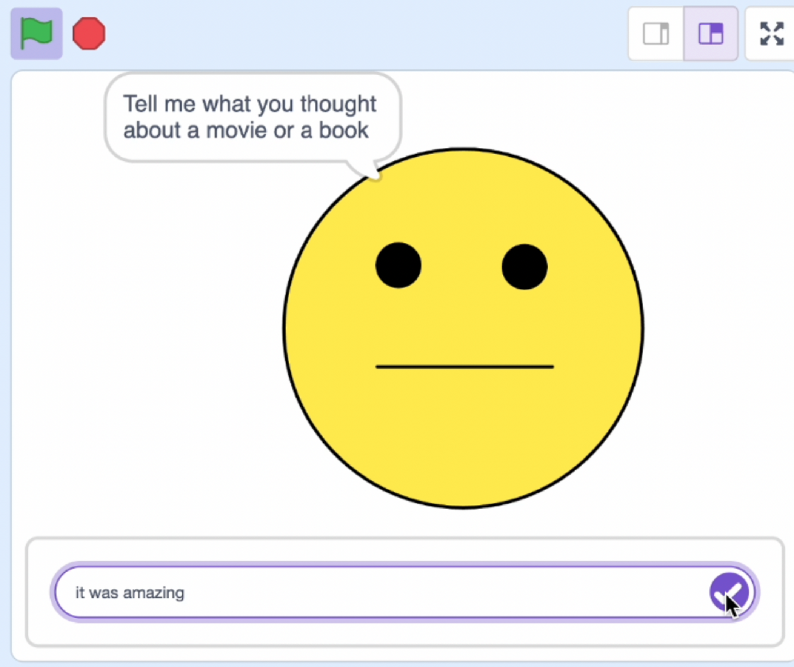

## What you will make

Create a character that will react to what you say about a movie or book, either positive or negative.

--- collapse ---

---
title: Where are my comments stored?
---

- This project uses a technology called 'machine learning'. Machine learning systems are trained using a large amount of data. 
- This project does not require you to create an account or log in. For this project, the examples you use to make the model are only stored temporarily in your browser (only on your machine).

--- /collapse ---

--- collapse ---
---
title: No YouTube? Download the videos!
---

You can [download all the videos for this project](https://rpf.io/p/en/did-you-like-it-go){:target="_blank"}. 

--- /collapse ---

--- collapse ---
---
title: License
---

This project is dual-licensed under both a [Creative Commons Attribution Non-Commercial Share-Alike License](http://creativecommons.org/licenses/by-nc-sa/4.0/){:target="_blank"} and an [Apache License Version 2.0](http://www.apache.org/licenses/LICENSE-2.0){:target="_blank"}.

We'd like to thank Dale from machinelearningforkids.co.uk for all his work on this project.

--- /collapse ---

