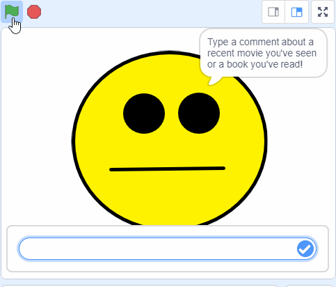
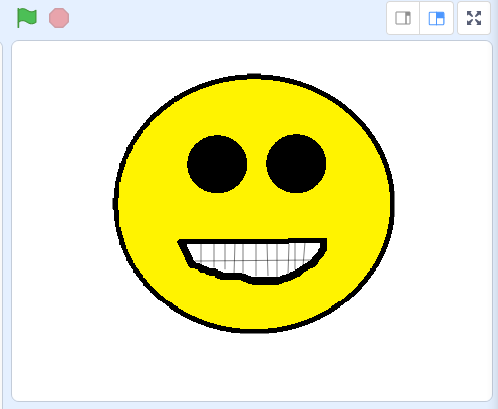

## Introduction

Create a character that will react to what you say about a movie or book, either positive or negative.

--- no-print ---

--- /no-print ---

--- print-only ---

--- /print-only ---

--- collapse ---
---
title: License
---

This project is dual-licensed under both a [Creative Commons Attribution Non-Commercial Share-Alike License](http://creativecommons.org/licenses/by-nc-sa/4.0/){:target="_blank"} and an [Apache License Version 2.0](http://www.apache.org/licenses/LICENSE-2.0){:target="_blank"}.

We'd like to thank Dale from machinelearningforkids.co.uk for all his work on this project.

--- /collapse ---

