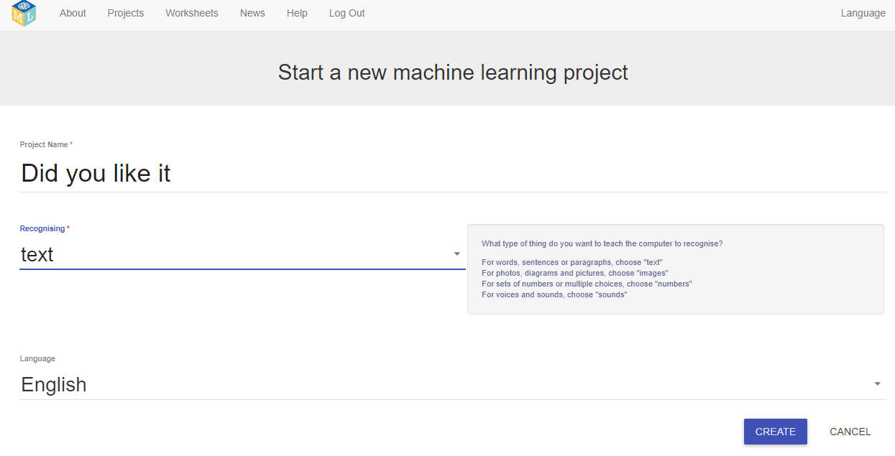

## How to create a project and sprite costumes

--- task ---
+ Go to [machinelearningforkids.co.uk](https://machinelearningforkids.co.uk/){:target="_blank"} in a web browser. 

+ Click on **Get Started**

+ **If** you have an account, click on **Log In** and type your username and password. Otherwise, click on **Try it now**
--- /task ---

--- task ---
+ Click the **+ Add a new project** button.

+ Name your project 'Did you like it' and set it to learn to recognise **“text”**.  Click **Create**.

+ You should now see 'Did you like it' in the projects list. Click on this project.
--- /task ---

--- task ---
+ Now get a project ready in Scratch. 

+ Click **Make**

+ Click **Scratch 3**

+ Click on **Scratch by itself**. The page then warns you that you haven’t done any machine learning yet. Click on **Scratch by itself** to launch Scratch.

+ Delete the cat sprite.

+ Create a new sprite by clicking on the **Paint** icon in the new sprite menu.

+ Draw a face without a mouth

+ Right-click on the costume and click "duplicate". Repeat one more time so you have **three** copies of the costume.

+ Name the three costumes "not sure", "like" and "dislike". Type the names into the white box shown by the arrow below.

+ Draw a mouth on each of the costumes. The “not sure” face should be a straight line. The “like” face should have a smile. The “dislike” face should look sad.

--- /task ---