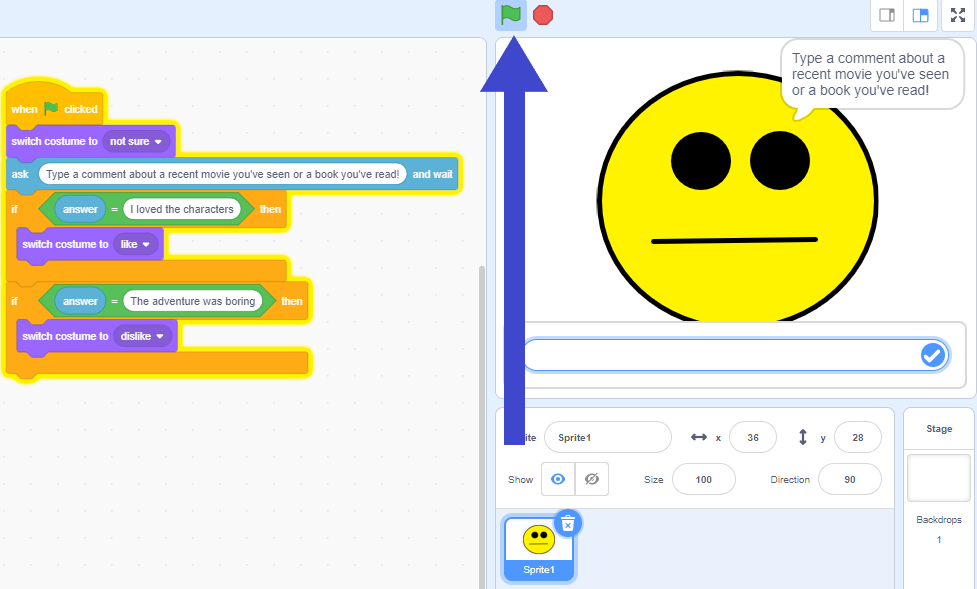

## Add a list of rules

In this step, you will include a list of rules to change the costume to like or dislike.

--- task ---
+ Click on the **Code** tab and enter the following code. 

```blocks3
when green flag clicked
switch costume to (not sure v)
ask [Type a comment about a recent movie you've seen or book you've read!] and wait
if <(answer) = [I loved the characters]> then
switch costume to (like v)
end
if <(answer) = [The adventure was boring]> then
switch costume to (dislike v)
end
```

+ Click on **File** and then on **Save to your computer**, and save the program to a file.
--- /task ---

--- task ---

+ Click on the **green flag** to test your program. 


+ Type in a comment about a movie or book you seen and watch it react! Type “I loved the characters” and press enter. The character smiles. Click the green flag again and type “The adventure was boring”. The character cries. Type anything else, and the character’s face won’t change.
--- /task ---

You’ve created a character that should react to what people type, and programmed it using a simple rules-based approach.
If you want it to react to other messages, you need to add more **if** blocks.
The problem with this is that you need to predict exactly what messages the character will receive. Making a list of every possible message would take forever!
