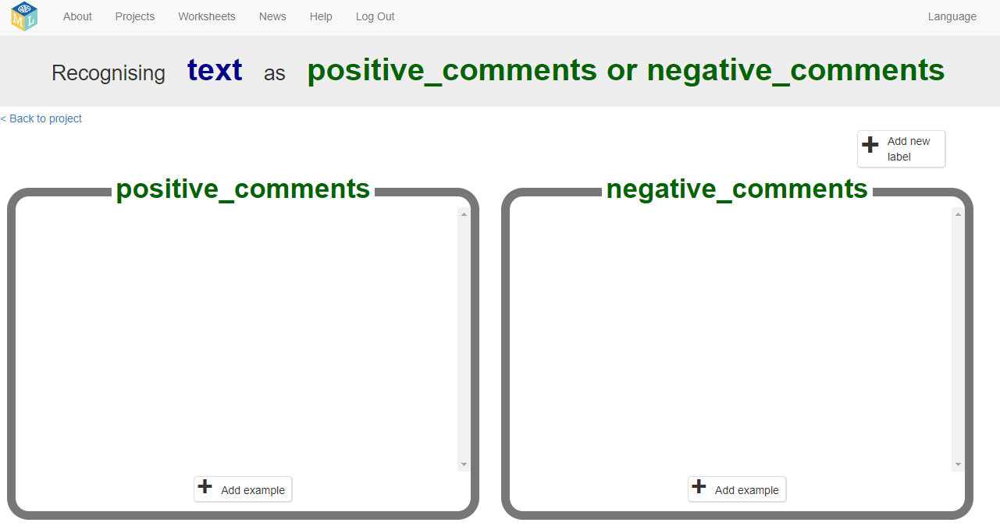

## Collect examples for training

Next, try a better approach: teaching the computer to recognise messages for itself.

--- task ---
+ Close the Scratch window and go back to the Machine Learning for Kids website.

+ Click on **< Back to project**.
--- /task ---

--- task ---
+ You need to collect some examples to train the computer. Click the **Train** button.

+ Click on **+ Add new label** and call it `positive comments`.  Do that again, and create a second bucket called `negative comments`. 

+ Click on the **Add example** button in the **positive comments** bucket, and type in the nicest comment about a movie or book that you can think of. 

+ Click on the **Add example** button in the **negative comments** bucket, and type in the meanest comment about a movie or book that you can think of. 
--- /task ---

--- task ---
+ Continue to **Add examples** until you have got at least **six** compliments and **six** insults.

--- collapse ---
---
title: Tips for creating good examples
---
+ **More is good**: The more examples you give your program, the better the program should get at determining whether your comments are positive or negative. 

+ **Equal numbers**: Add roughly the same number of examples for each type of comment. If you have a lot of examples for one type and not the other, this can affect the way that the program learns to recognise them. 

+ **Make the examples really different from each other**: Try to think of lots of different types of example. For example, make sure that you include some long examples and some very short ones.
 
--- /collapse ---
--- /task ---

