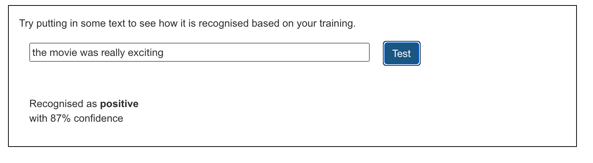

## Train the model

You have gathered the examples you need, now you will use these examples to train your machine learning model.

--- task ---

+ Click on **Back to project** in the top left-hand corner.

+ Click on **Learn & Test**.

+ Click on the button labelled **Train new machine learning model**. This may take a few minutes to complete.

--- /task ---

Once the training has finished, you can test how well your model recognises whether a comment is positive or negative. Make sure you test examples that you haven’t used before. 

--- task ---

+ Type something nice, and press <kbd>Enter</kbd>. It should be recognised as positive.
+ Type something critical, and press <kbd>Enter</kbd>. It should be recognised as negative.

--- /task ---

If you are not happy with how the model recognises the comments, go back to the **Train** page and add more examples, then train your model again.

