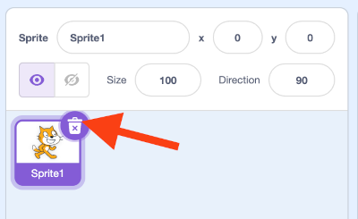
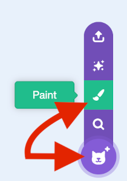
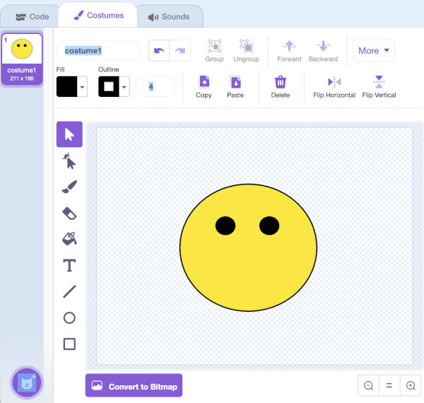
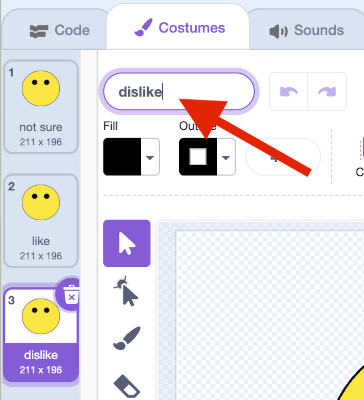
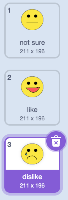

## Create an emoji 

Now that your model can distinguish between positive and negative comments, you can use it in a Scratch program to show an emoji reaction.

--- task ---
+ Click on the **< Back to project** link.

+ Click on **Make**.

+ Click on **Scratch 3**.

+ Click on **Open in Scratch 3**.

--- /task ---

--- task ---
+ Delete the cat sprite.

--- /task ---

--- task ---
+ Open the new sprite menu and click on the **Paint** icon to create a new sprite.

--- /task ---

--- task ---
+ Draw a face without a mouth.

--- /task ---

--- task ---
+ Right-click on the costume and click on **duplicate** to create a copy. Repeat one more time so that you have **three** copies of the costume.

--- /task ---

--- task ---
+ To rename a costume, type a new name into the white box. Name the three costumes `not sure`, `like` and `dislike`. 

--- /task ---

--- task ---
+ Draw a mouth on each of the costumes to represent each emotion.

--- /task ---

