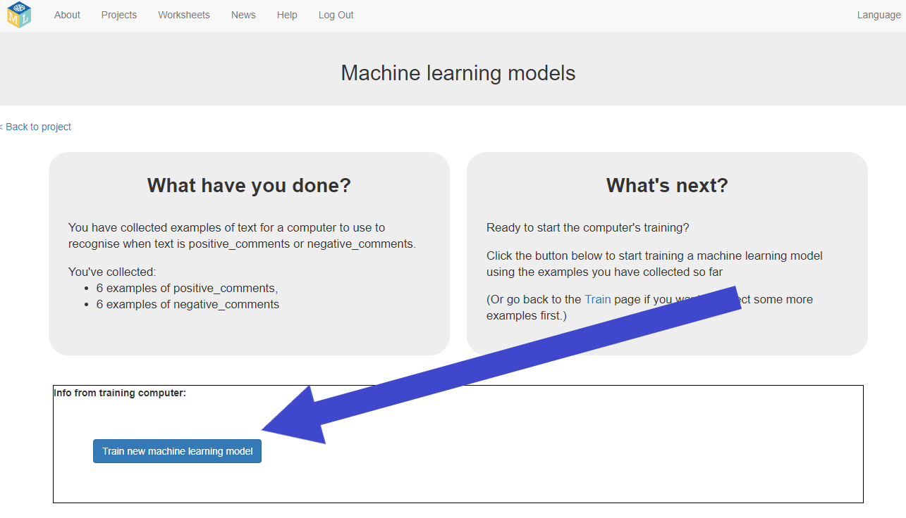
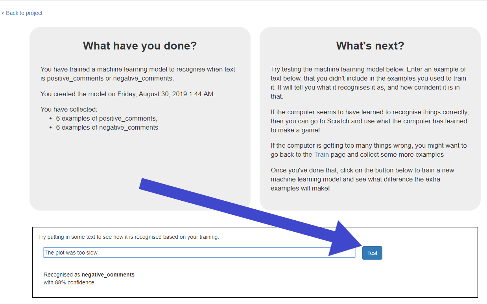

## Train and test your machine learning model

In this step you will train your machine to recognise whether your comment is positive or negative and automatically put it in one of the 2 buckets based on the examples you have added.

--- task ---
+ Click on the **< Back to project** link, then click **Learn & Test**

+ Click on the **Train new machine learning model** button. If you have enough examples, the program should start to learn how to recognise comments from the examples you’ve given to it, as either positive or negative.

--- /task ---

Wait for the training to complete. This might take a minute.

--- task ---
Once the training has completed, a Test box will be displayed. Try testing your machine learning model to see what it has learned. 
+ Type something nice, and press enter. It should be recognised as positive.
+ Type something critical, and press enter. It should be recognised as negative.
+ Test it with examples that you haven’t shown the computer before.
If you’re not happy with how the computer recognises the comments, go back to the previous step and add some more examples. 
Make sure you repeat this step to train with the new examples though!

--- /task ---

You’ve started to train a computer to recognise text as being positive or negative. Instead of trying to write rules to be able to do this, you are doing it by collecting examples. These examples are being used to train a machine learning “model”.
This is called “supervised learning” because of the way you are supervising the computer’s training.
The computer will learn from patterns in the examples you’ve given it, such as the choice of words, and the way sentences are structured. These will be used to be able to recognise new messages. 