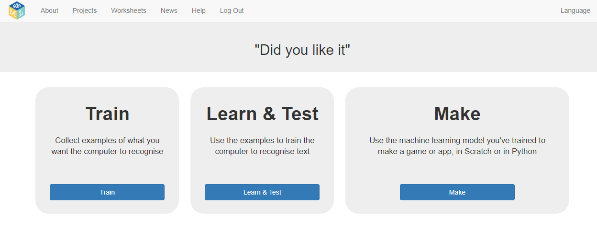
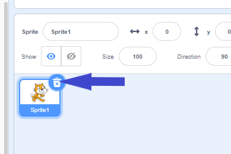
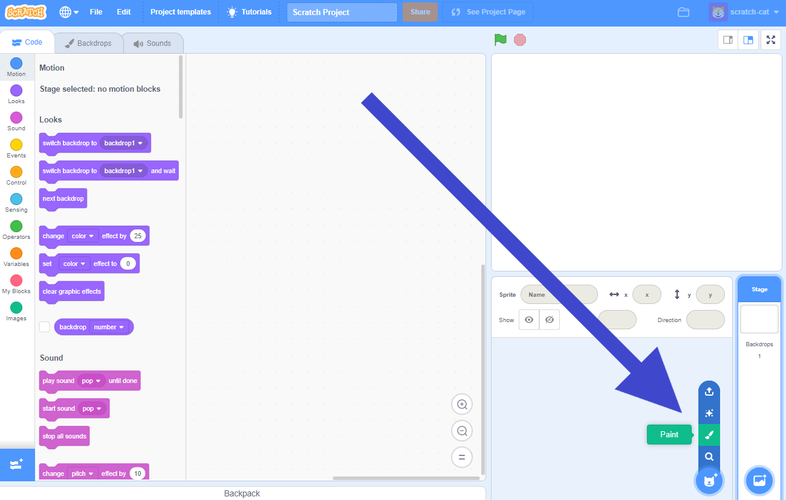
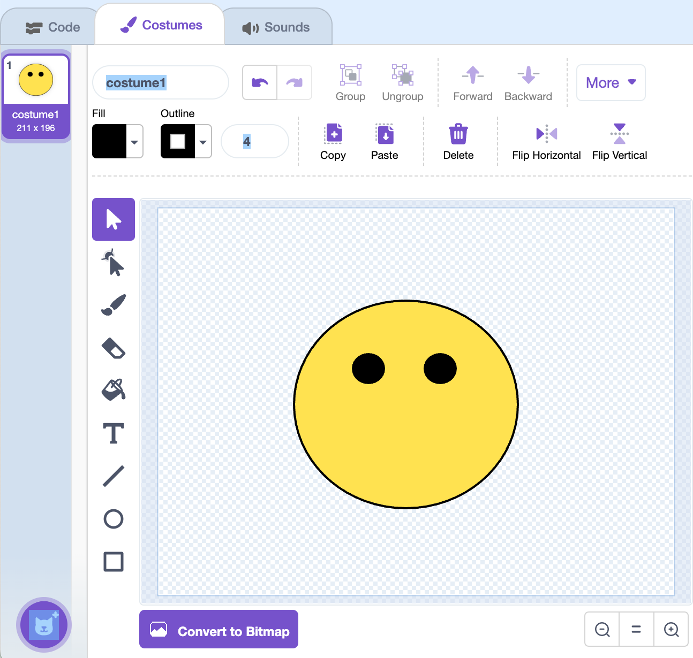
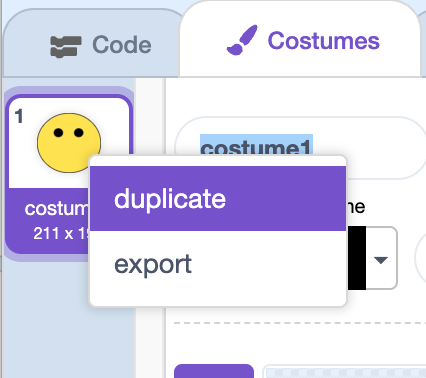
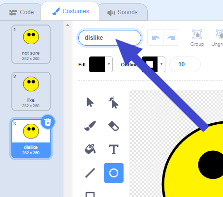
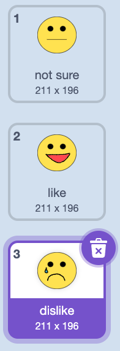
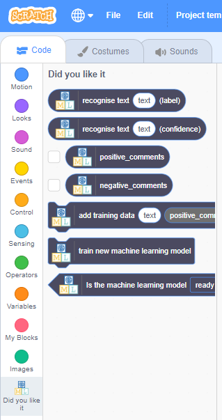
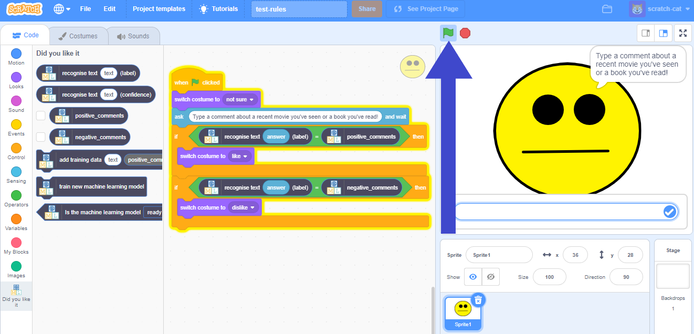
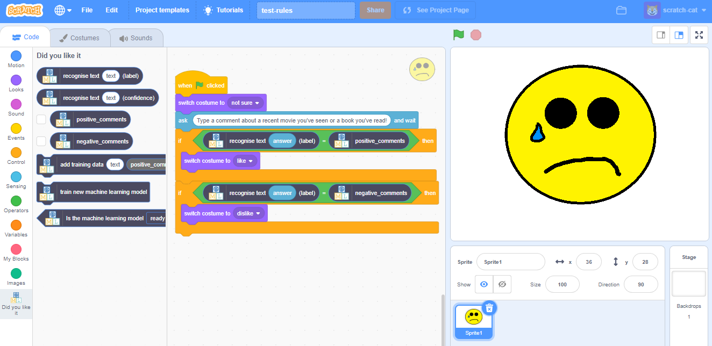

## Use your machine learning model in Scratch

Now, update your Scratch program to include your machine learning model instead of a rules-based approach.

--- task ---
+ Now, get a project ready in Scratch. 

+ Click on **Make**.

+ Click on **Scratch 3**.

+ The page then warns you that you haven’t done any machine learning yet. Click on **Scratch by itself** to launch Scratch.

+ Delete the cat sprite.

+ Go to the new sprite menu and click on the **Paint** icon to create a new sprite.

+ Draw a face without a mouth.

+ Right-click on the costume and click on **duplicate**. Repeat one more time so that you have **three** copies of the costume.

+ Name the three costumes `not sure`, `like` and `dislike`. Type the names into the white box shown by the arrow below.

+ Draw a mouth on each of the costumes. The **not sure** face should have a straight line as its mouth. The **like** face should have a smile. The **dislike** face should look sad.

--- /task ---

--- task ---
+ Click on **< Back to project**.

+ Click on **Make**.

+ Click on **Scratch 3**.

+ Click the **Open in Scratch 3** button to launch the Scratch editor. You should see new blocks from your project at the bottom of the list.

+ Load the Scratch project that you saved earlier: click on **File**, then on **Load from your computer**, then select the Scratch project that you saved earlier.
--- /task ---

--- task ---
+ Click on the **Code** tab, then update your Scratch code to use your machine learning model **instead** of the rules that you added earlier.
The `recognise text … (label)` block is a new block added by your project. If you give it text, it will return return either `positive comments` or `negative comments` based on the training that you’ve given to the computer.
You can use this to choose the costume to switch to.

--- /task ---

--- task ---
+ Click on the **green flag** to test your project again.

+ Type in a nice message and press <kbd>Enter</kbd>. The character should smile.
Click on the **green flag** again. Type in a negative message and press <kbd>Enter</kbd>. The character should look sad. 
Make sure that you test that this works **even for messages that you didn’t include in your training.**

+ Save your project: click on **File**, then on **Save to your computer**.
--- /task ---

You have now modified your Scratch character to use machine learning instead of your earlier rules-based approach. Training the computer to be able to recognise messages for itself should be much quicker than trying to make a list of every possible message. The more examples you give it, the better it should get at recognising messages correctly.
