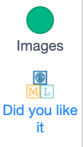
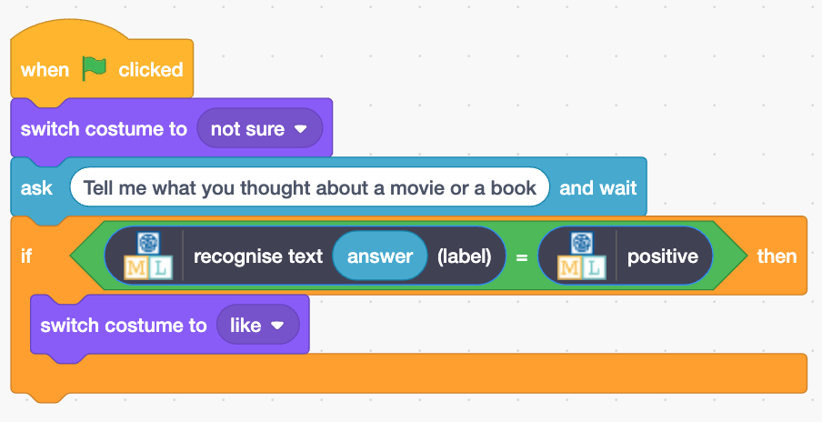
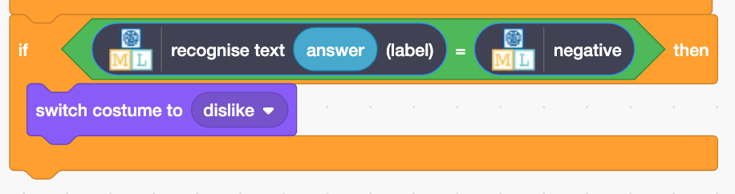

## Show a reaction

Machine Learning for Kids has added some special blocks to Scratch to allow you to use the model you just trained. Find them at the bottom of the blocks list.

--- task ---
+ Click on the **Code** tab 
--- /task ---

--- task ---
+ Add some code to ask the model to recognise whether the text is positive. If it is, the emoji will display the `like` face.

--- /task ---

--- task ---
+ Click on the **green flag** to test your project. Type in a nice message and press <kbd>Enter</kbd>. The character should smile.
--- /task ---

Make sure that you test that this works **even for messages that you didn’t include in your training.**

--- task ---

+ Add some more code so that `if` the model recognises a negative comment, it displays the `dislike` costume.

--- collapse ---
---
title: Show me how
---

--- /collapse ---

--- /task ---

--- task ---
+ Click on the **green flag** again. Type in a negative message and press <kbd>Enter</kbd>. The character should look sad. 
--- /task ---

