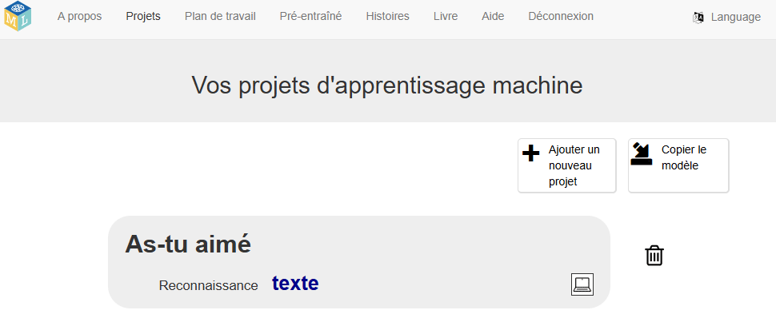

## Configurer le projet

<html>
  

    <iframe style="position: absolute; top: 0; left: 0; right: 0; width: 100%; height: 100%; border: none;" src="https://www.youtube.com/embed/qD3ZlC_yzxA?rel=0&cc_load_policy=1" allowfullscreen allow="accelerometer; autoplay; clipboard-write; encrypted-media; gyroscope; picture-in-picture; web-share"></iframe>
  

</html>

--- task ---

+ Va sur [https://machinelearningforkids.co.uk](https://machinelearningforkids.co.uk/){:target="_blank"} dans un navigateur web.

+ Clique sur **Démarrez**.

+ Clique sur **Essayer maintenant**.

--- /task ---

--- task ---

+ Clique sur **Projets** dans la barre de menus en haut de la page.

+ Clique sur le bouton **+ Ajouter un nouveau projet**.

+ Nomme ton projet `As-tu aimé` et configure-le pour qu'il apprenne à reconnaître les **sons**et stocke les données **dans ton navigateur web**. Clique ensuite sur **Faire**. 

+ Tu devrais maintenant voir « As-tu aimé » dans la liste des projets. Clique sur le projet. 

--- /task ---

--- task ---

+ Clique sur le bouton **Entraîner**. 

--- /task ---

