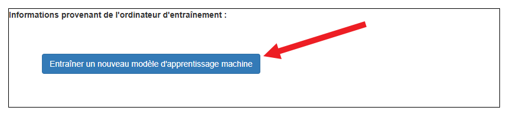
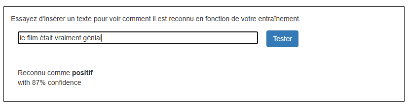

## Entraîner le modèle

<html>
  

    <iframe style="position: absolute; top: 0; left: 0; right: 0; width: 100%; height: 100%; border: none;" src="https://www.youtube.com/embed/y-Cf153mlwo?rel=0&cc_load_policy=1" allowfullscreen allow="accelerometer; autoplay; clipboard-write; encrypted-media; gyroscope; picture-in-picture; web-share"></iframe>
  

</html>

Tu as rassemblé les exemples dont tu as besoin, tu vas maintenant utiliser ces exemples pour entraîner ton modèle d'apprentissage automatique.

--- task ---

+ Clique sur **Revenir au projet** dans le coin supérieur gauche.

+ Clique sur **Apprendre & Tester**.

+ Clique sur le bouton **Entraîner un nouveau modèle d'apprentissage machine**. Cela peut prendre quelques minutes. 

--- /task ---

Une fois l'entraînement terminé, tu peux tester dans quelle mesure ton modèle reconnaît si un commentaire est positif ou négatif. Assure-toi de tester des exemples que tu n'as jamais utilisés auparavant.

--- task ---

+ Tape quelque chose de sympa, et appuie sur <kbd>Entrée</kbd>. Il devrait être reconnu comme positif.
+ Tape quelque chose de critique, et appuie sur <kbd>Entrée</kbd>. Il devrait être reconnu comme négatif.

--- /task ---

Si tu n'es pas satisfait·e de la façon dont le modèle reconnaît les commentaires, retourne à la page **Entraîner** et ajoute d'autres exemples, puis entraîne ton modèle à nouveau.

