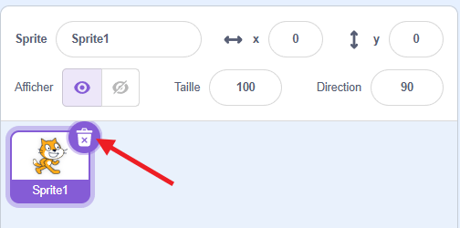
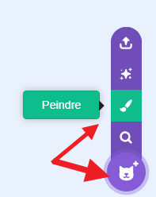
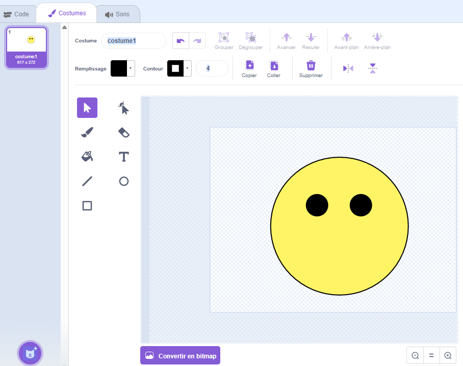
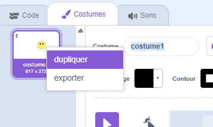
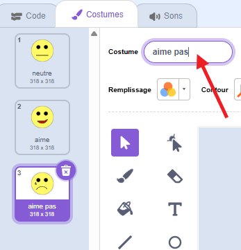
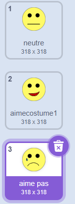

## Créer un emoji

<html>
  

    <iframe style="position: absolute; top: 0; left: 0; right: 0; width: 100%; height: 100%; border: none;" src="https://www.youtube.com/embed/RIz7WHhlBnQ?rel=0&cc_load_policy=1" allowfullscreen allow="accelerometer; autoplay; clipboard-write; encrypted-media; gyroscope; picture-in-picture; web-share"></iframe>
  

</html>

Maintenant que ton modèle peut faire la distinction entre les commentaires positifs et négatifs, tu peux l’utiliser dans un programme Scratch pour afficher une réaction emoji.

--- task ---

+ Clique sur le lien **< Revenir au projet**.

+ Clique sur **Faire**.

+ Clique sur **Scratch 3**.

+ Clique sur **Ouvrir dans Scratch 3**.

--- /task ---

--- task ---

+ Supprime le sprite chat.

--- /task ---

--- task ---

+ Ouvre le nouveau menu sprite et clique sur l'icône **Peindre** pour créer un nouveau sprite. 

--- /task ---

--- task ---

+ Dessine un visage sans bouche. 

--- /task ---

--- task ---

+ Fais un clic droit sur le costume, puis clique sur **dupliquer** pour créer une copie. Répète une fois de plus pour avoir **trois** copies du costume. 

--- /task ---

--- task ---

+ Pour renommer un costume, tape un nouveau nom dans la case blanche. Nomme les trois costumes `neutre`, `aime`, et `aime pas`. 

--- /task ---

--- task ---

+ Dessine une bouche sur chacun des costumes pour représenter chaque émotion. 

--- /task ---

