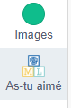
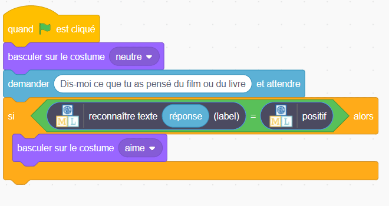
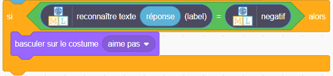

## Afficher une réaction

<html>
  

    <iframe style="position: absolute; top: 0; left: 0; right: 0; width: 100%; height: 100%; border: none;" src="https://www.youtube.com/embed/h6UBW0pWxmI?rel=0&cc_load_policy=1" allowfullscreen allow="accelerometer; autoplay; clipboard-write; encrypted-media; gyroscope; picture-in-picture; web-share"></iframe>
  

</html>

Machine Learning for Kids a ajouté des blocs spéciaux à Scratch pour te permettre d'utiliser le modèle que tu viens d'entraîner. Trouve-les en bas de la liste des blocs.

--- task ---

+ Clique sur l'onglet **Code**.

--- /task ---

--- task ---

+ Ajoute du code pour demander au modèle de reconnaître si le texte est positif. Si c'est le cas, l'emoji affichera le visage `aime`. 

--- /task ---

--- task ---

+ Clique sur le drapeau **vert** pour tester ton projet. Tape un beau message et appuie sur <kbd>Entrée</kbd>. Le personnage devrait sourire.

--- /task ---

Assure-toi de tester que cela fonctionne **même pour les messages que tu n'as pas inclus dans tes exemples d'entraînement**.

--- task ---

+ Ajoute un peu de code supplémentaire pour que `si` le modèle reconnaît un commentaire négatif, il affiche le costume `aime pas`.

--- collapse ---
---
title: Montre-moi comment
---

--- /collapse ---

--- /task ---

--- task ---

+ Clique à nouveau sur le **drapeau vert**. Tape un message négatif et appuie sur <kbd>Entrée</kbd>. Le personnage devrait avoir l’air triste.

--- /task ---

