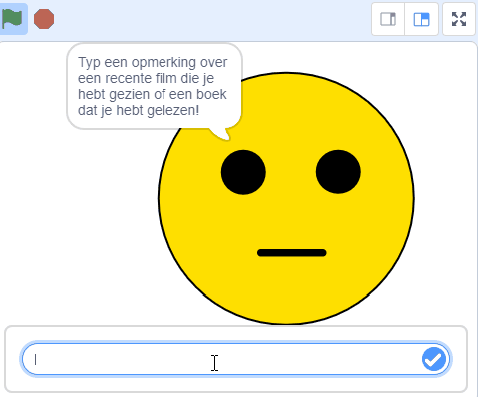
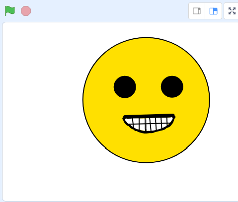

## Inleiding

In dit project gebruik je [machinelearningforkids.co.uk](machinelearningforkids.co.uk){:target="_blank"} om een personage te maken dat bepaalt of je een film of boek leuk of niet leuk vond op basis van wat je zegt. Als je iets positiefs zegt, zal het glimlachen. Als je iets negatiefs zegt, zal het huilen. Eerst programmeer je een lijst met regels voor het begrijpen van berichten en leer je waarom die aanpak niet erg goed is. Vervolgens leer je de computer om berichten als positief of negatief te herkennen door er voorbeelden van te geven.

### Wat ga je maken
\--- no-print \---  \--- / no-print \---

\--- print-only \---  \--- /print-only \--- \--- collapse \---
---
title: Wat ga je leren
---

+ Een machine learning-model trainen en testen
+ Waarom deze aanpak beter is dan het gebruik van een lange lijst met regels
+ Een getraind model gebruiken in een Scratch 3-programma

\--- /collapse \---

\--- collapse \---
---
title: Wat heb je nodig
---

+ Een computer verbonden met internet

\--- /collapse \---

\--- collapse \---
---
title: Aanvullende informatie voor docenten
---

Als je dit project wilt afdrukken, gebruik dan de [printervriendelijke versie](https://projects.raspberrypi.org/en/projects/did-you-like-it/print){:target="_ blank"}.

\--- /collapse \---

### Licentie

This project is dual-licensed under both a [Creative Commons Attribution Non-Commercial Share-Alike License](http://creativecommons.org/licenses/by-nc-sa/4.0/){:target="_blank"} and an [Apache License Version 2.0](http://www.apache.org/licenses/LICENSE-2.0){:target="_blank"}

We'd like to thank Dale from machinelearningforkids.co.uk for all his work on this project.