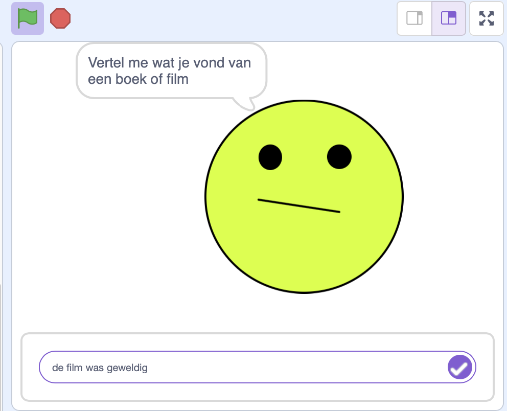

## Wat ga je maken

Bedenk een personage dat reageert op wat je zegt over een film of boek, zowel positief als negatief.

--- collapse ---

---
title: Waar worden mijn opmerkingen opgeslagen?
---

- Dit project maakt gebruik van een technologie genaamd 'machine learning'. Machine learning-systemen worden getraind met behulp van een grote hoeveelheid data.
- Voor dit project hoef je geen account aan te maken of in te loggen. Voor dit project worden de voorbeelden die je gebruikt om het model te maken tijdelijk opgeslagen in je browser (alleen op jouw machine).

--- /collapse ---

--- collapse ---
---
title: Geen YouTube? Download de video's!
---

Je kunt [alle video's voor dit project downloaden](https://rpf.io/p/en/did-you-like-it-go){:target="_blank"}.

--- /collapse ---

--- collapse ---
---
title: Licentie
---

Dit project heeft een dubbele licentie onder zowel een [Creative Commons Attribution Non-Commercial Share-Alike-licentie](http://creativecommons.org/licenses/by-nc-sa/4.0/){:target="_blank"} en een [Apache-licentie versie 2.0](http://www.apache.org/licenses/LICENSE-2.0){:target="_blank"}

We willen Dale van machinelearningforkids.co.uk graag bedanken voor al zijn werk aan dit project.

--- /collapse ---

