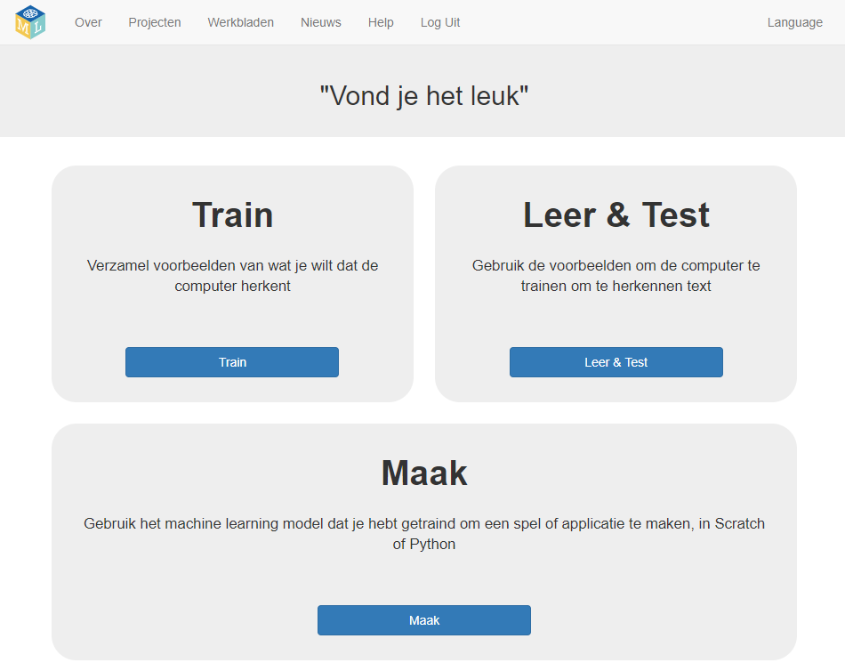
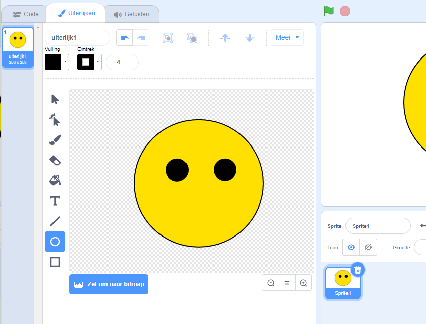
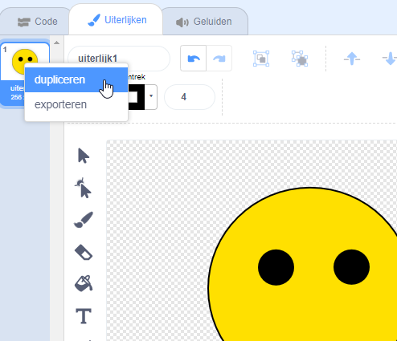

## Maak een project en sprite uiterlijken

\--- task \---
+ Ga naar [machinelearningforkids.co.uk](https://machinelearningforkids.co.uk/){:target="_blank"} in een webbrowser.

+ Klik op **Begin**.

+ Klik op **probeer nu**. \--- /task \---

\--- task \---
+ Klik op de knop **+ Voeg een nieuw project toe**.

+ Noem jouw project `Vond je het leuk` en stel Herkenning in op `tekst` en zet de Taal op Dutch (Nederlands).  Klik op **Creëer**. 

+ Je zou nu `Vond je het leuk` in de projectenlijst moeten zien. Klik op je project. \---/task\---

\--- task \---
+ Maak nu een project klaar in Scratch.

+ Klik op **Maak**. 

+ Klik op **Scratch 3**.

+ De pagina waarschuwt je vervolgens dat je nog geen machine learning hebt uitgevoerd. Klik op **Scratch automatisch starten** om Scratch te starten.

+ Verwijder de katten sprite. 

+ Ga naar het kies een sprite-menu en klik op het pictogram **Teken** om een nieuwe sprite te maken. 

+ Teken een gezicht zonder mond. 

+ Klik met de rechtermuisknop op het kostuum en klik op **dupliceren**. Herhaal dit nog een keer, zodat je **drie** exemplaren van het uiterlijk hebt. 

+ Noem de drie kostuums `weet niet`, `leuk` en `niet leuk`. Typ de namen in het witte vak dat wordt weergegeven door de pijl hieronder. 

+ Teken een mond op elk van de kostuums. De **weet niet** gezicht moet een rechte lijn hebben als mond. Het gezicht van **leuk** moet een glimlach hebben. De **niet leuk** gezicht moet er verdrietig uitzien.  \--- /task \---
