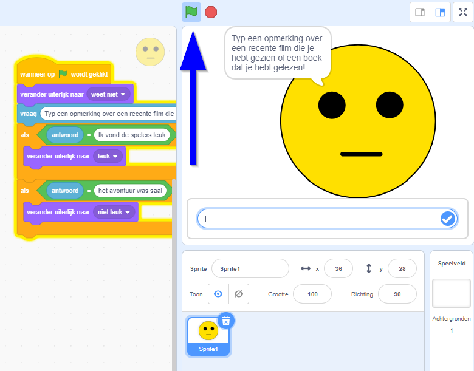

## Voeg een lijst met regels toe

In deze stap neem je een lijst met regels op om het kostuum te wijzigen in **leuk** of **niet leuk**.

\--- task \---
+ Klik op het tabblad **Code** en voer de volgende code in.

```blocks3
wanneer groene vlag wordt aangeklikt
verander uiterlijk naar (weet niet v)
vraag [Typ een opmerking over een recente film die je hebt gezien of een boek dat je hebt gelezen!] en wacht
als <<(antwoord) = [Ik vond de spelers leuk]> dan 
verander uiterlijk naar (leuk v)
end
als <(antwoord) = [het avontuur was saai]> dan 
verander uiterlijk naar (niet leuk v)
end
```

+ Klik op **Bestand** en vervolgens op **Opslaan op je computer** om het programma op te slaan in een bestand. \--- /task \---

\--- task \---

+ Klik op de **groene vlag** om je programma te testen. 

+ Typ een opmerking over een film of boek en kijk hoe het reageert! Typ `Ik vond de spelers leuk` en druk op <kbd>Enter</kbd>. Het karakter zal glimlachen. Klik nogmaals op de groene vlag, typ `het avontuur was saai`en druk op <kbd>Enter</kbd>. Het karakter zal huilen. Typ iets anders in, druk <kbd>Enter</kbd>, en het gezicht van het karakter zal niet veranderen. \--- /task \---

Je hebt een karakter gemaakt dat zou moeten reageren op wat mensen typen en het met een eenvoudige, op regels gebaseerde aanpak geprogrammeerd. Als je wilt dat het op andere berichten reageert, moet je meer `als` blokken gebruiken. Het probleem hiermee is dat je precies moet voorspellen welke berichten het personage zal ontvangen - het zou een eeuwigheid duren om een lijst te maken van alle mogelijke berichten!
