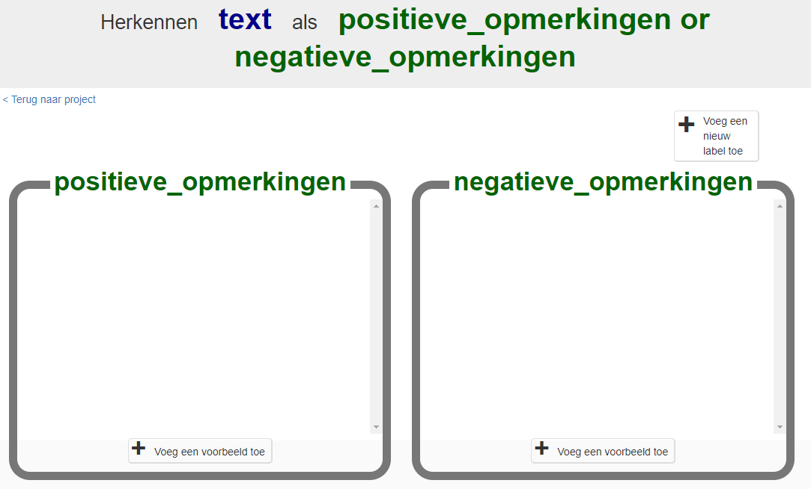

## Verzamel voorbeelden voor training

Probeer vervolgens een betere aanpak: leer de computer berichten zelf te herkennen.

\--- task \---
+ Sluit het Scratch-venster en ga terug naar de website Machine Learning for Kids.

+ Klik op **< Terug naar project**. \--- /task \---

\--- task \---
+ Je moet enkele voorbeelden verzamelen om de computer te trainen. Klik op de knop **Train**. 

+ Klik op **+ Voeg een nieuw label toe** en noem het `positieve opmerkingen`.  Doe dat nog een keer en maak een tweede container met de naam `negatieve opmerkingen` aan. 

+ Klik op de knop **Voeg een voorbeeld toe** in de container voor **positieve opmerkingen** en typ de leukste opmerking over een film of boek die je maar kunt bedenken.

+ Klik op de knop **Voeg een voorbeeld toe** in de container met **negatieve opmerkingen** en typ de gemeenste opmerking over een film of boek die je maar kunt bedenken. \--- /task \---

\--- task \---
+ Ga verder naar **Voeg een nieuw label toe** totdat je minstens **zes** complimenten en **zes** beledigingen hebt. 

\--- collapse \---
---
title: Tips voor het maken van goede voorbeelden
---
+ **Hoe meer hoe beter**: hoe meer voorbeelden je geeft aan jouw programma, hoe beter het programma zal worden in het bepalen of je opmerkingen positief of negatief zijn.

+ **Gelijke aantallen**: voeg ongeveer hetzelfde aantal voorbeelden toe voor elk type opmerking. Als je veel voorbeelden hebt voor het ene type en weinig voor de andere, kan dit van invloed zijn op de manier waarop het programma ze leert herkennen.

+ **Maak de voorbeelden echt verschillend van elkaar**: Probeer veel verschillende soorten voorbeelden te bedenken. Zorg er bijvoorbeeld voor dat je enkele lange en enkele zeer korte voorbeelden toevoegt.

\--- /collapse \--- \--- /task \---

