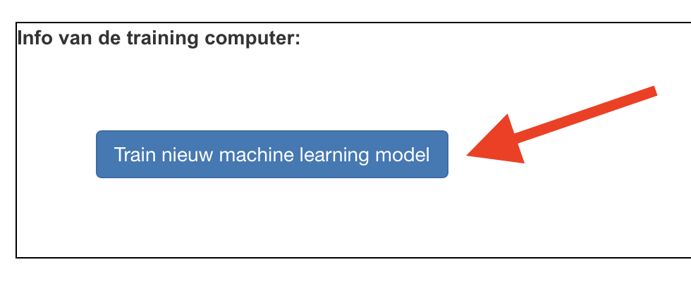
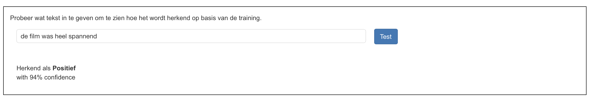

## Train het model

<html>
  

    <iframe style="position: absolute; top: 0; left: 0; right: 0; width: 100%; height: 100%; border: none;" src="https://www.youtube.com/embed/y-Cf153mlwo?rel=0&cc_load_policy=1" allowfullscreen allow="accelerometer; autoplay; clipboard-write; encrypted-media; gyroscope; picture-in-picture; web-share"></iframe>
  

</html>

Je hebt de voorbeelden verzameld die je nodig hebt, nu ga je deze gebruiken om jouw machine learning model te trainen.

--- task ---

+ Klik op **Terug naar project** in de linkerbovenhoek.

+ Klik op **Leer & Test**.

+ Klik op de knop met het label **Train nieuw machine learning model**. Dit kan enkele minuten duren.

--- /task ---

Zodra het trainen is voltooid, kun je testen hoe goed jouw model herkent of een opmerking positief of negatief is. Zorg ervoor dat je voorbeelden test die je nog niet eerder hebt gebruikt.

--- task ---

+ Typ iets leuks en druk op <kbd>Enter</kbd>. Het moet als positief worden herkend.
+ Typ iets kritisch en druk op <kbd>Enter</kbd>. Het moet als negatief worden herkend.

--- /task ---

Als je niet tevreden bent met hoe het model de opmerkingen herkent, ga dan terug naar de **Train** pagina en voeg meer voorbeelden toe, en train daarna je model opnieuw.

