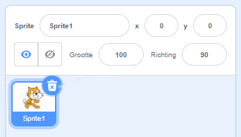
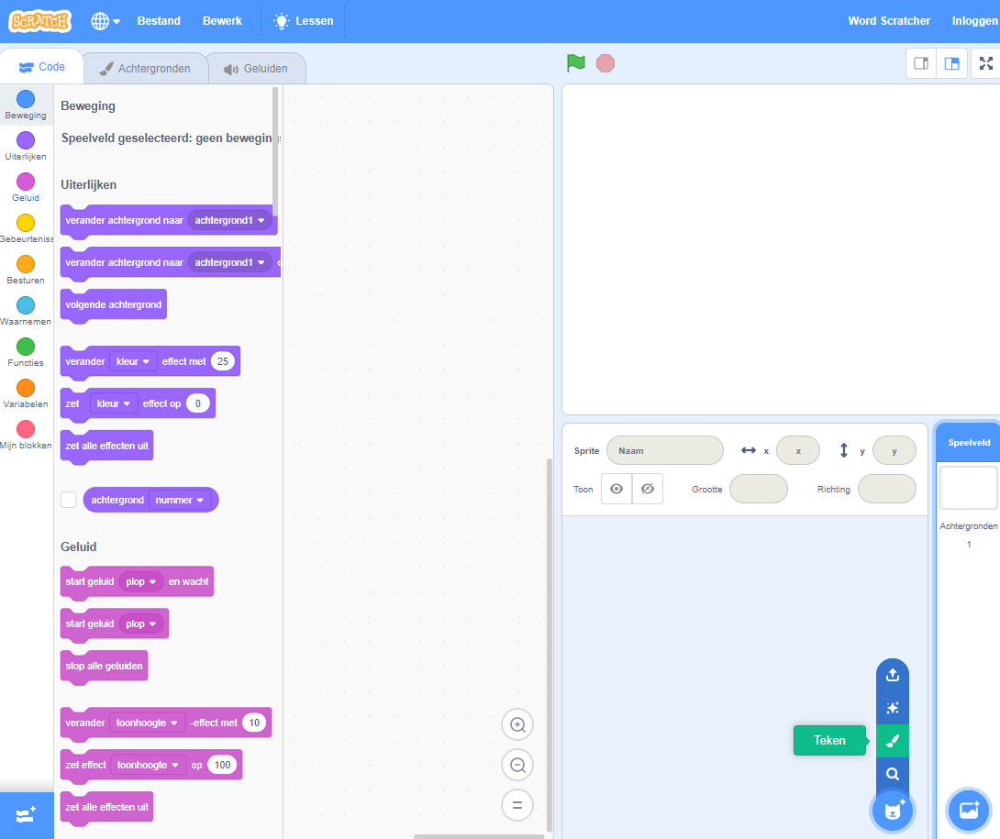
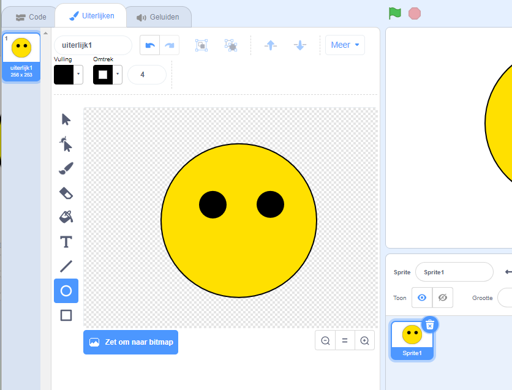
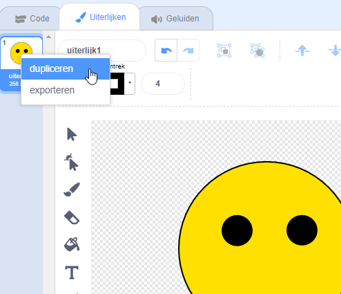
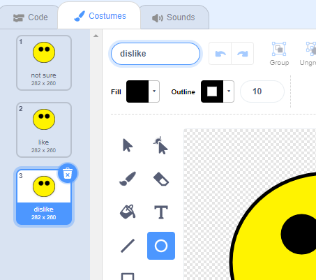
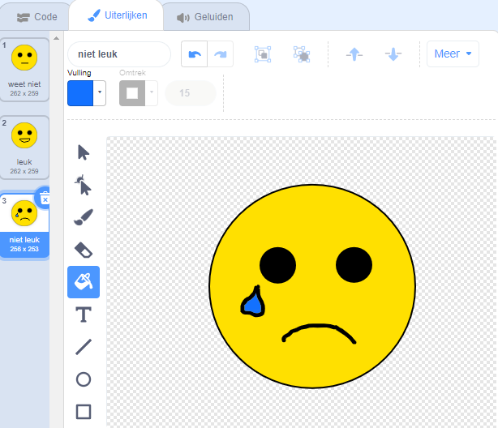

## Create an emoji

<html>
  

    <iframe style="position: absolute; top: 0; left: 0; right: 0; width: 100%; height: 100%; border: none;" src="https://www.youtube.com/embed/RIz7WHhlBnQ?rel=0&cc_load_policy=1" allowfullscreen allow="accelerometer; autoplay; clipboard-write; encrypted-media; gyroscope; picture-in-picture; web-share"></iframe>
  

</html>

Now that your model can distinguish between positive and negative comments, you can use it in a Scratch program to show an emoji reaction.

--- task ---
+ Click on the **< Back to project** link.

+ Click on **Make**.

+ Click on **Scratch 3**.

+ Click on **Open in Scratch 3**.

---/task---

--- task ---
+ Delete the cat sprite.  --- /task ---

--- task ---
+ Open the new sprite menu and click on the **Paint** icon to create a new sprite.  --- /task ---

--- task ---
+ Draw a face without a mouth.  --- /task ---

--- task ---
+ Right-click on the costume and click on **duplicate** to create a copy. Repeat one more time so that you have **three** copies of the costume.  --- /task ---

--- task ---
+ To rename a costume, type a new name into the white box. Name the three costumes `not sure`, `like`, and `dislike`.  --- /task ---

--- task ---
+ Draw a mouth on each of the costumes to represent each emotion.  --- /task ---

