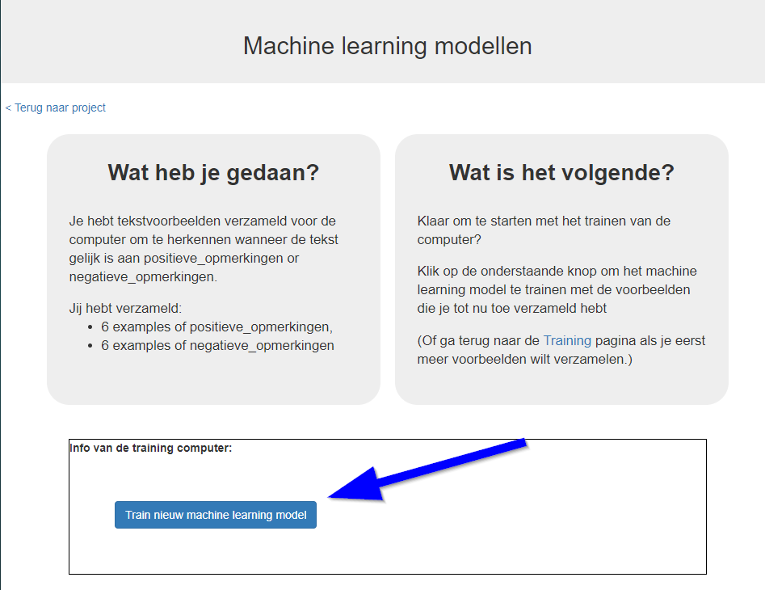
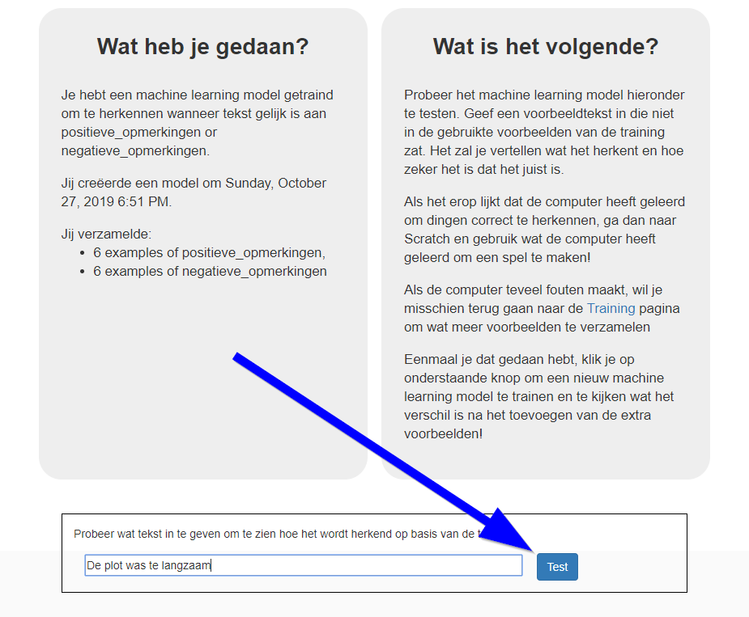

## Train en test je machine learning-model

In deze stap train je jouw machine om te herkennen of je opmerking positief of negatief is en plaats je deze automatisch in een van de twee containers op basis van de voorbeelden die je hebt toegevoegd.

--- task ---
+ Klik op **< Terug naar project**en vervolgens op **Leer & Test**.

+ Klik op de knop **Train nieuwe machine learning model**. Als je genoeg voorbeelden hebt, zou het programma moeten beginnen met uit de voorbeelden die je hebt gegeven te leren hoe reacties als positief of negatief te herkennen.

 --- /task ---

Wacht tot de training is voltooid. Dit kan een paar minuten duren.

--- task --- Nadat de training is voltooid, wordt een test vak weergegeven. Probeer je machine learning-model te testen om te zien wat het heeft geleerd.
+ Typ iets leuks en druk op <kbd>Enter</kbd>. Het moet als positief worden herkend.
+ Typ iets kritisch en druk op <kbd>Enter</kbd>. Het moet als negatief worden herkend.
+ Test het met voorbeelden die je de computer nog niet eerder hebt getoond.

Als je niet tevreden bent met hoe de computer de opmerkingen herkent, ga je terug naar de vorige stap en voeg je nog enkele voorbeelden toe. Zorg ervoor dat je deze stappen herhaalt om je computer te trainen met de nieuwe voorbeelden!  --- /task ---

Je bent begonnen met het trainen van een computer om tekst te herkennen als positief of negatief. In plaats van te proberen regels te schrijven om dit te kunnen doen, doe je dit door voorbeelden te verzamelen. Deze voorbeelden worden gebruikt om een machine learning-**'model'** te trainen. Dit wordt **supervised learning (begeleid leren)** genoemd vanwege de manier waarop je toezicht houdt op de training van de computer. De computer leert van patronen in de voorbeelden die je hebt gegeven, zoals de woordkeuze en de manier waarop zinnen zijn gestructureerd. Deze worden gebruikt om nieuwe berichten te herkennen. 
