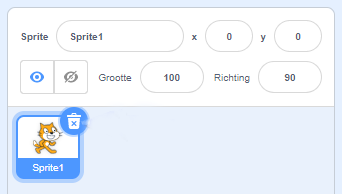
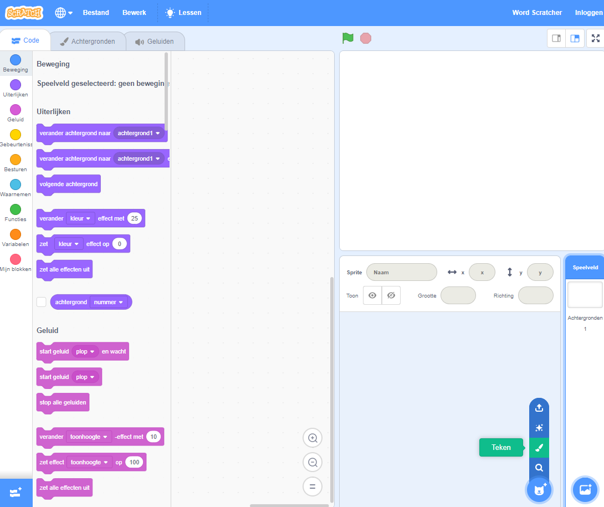
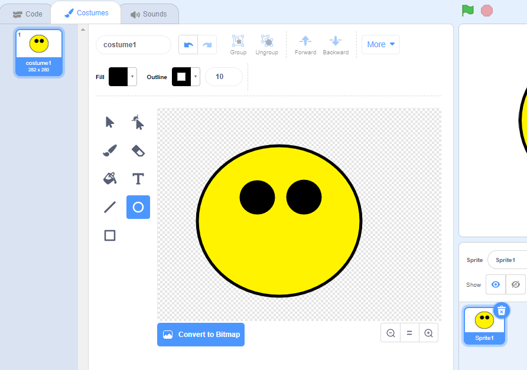
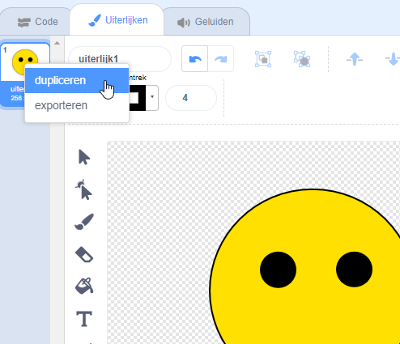
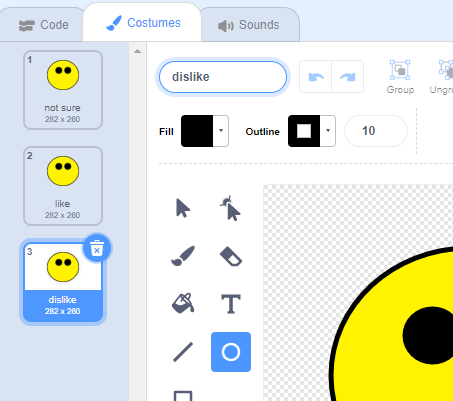
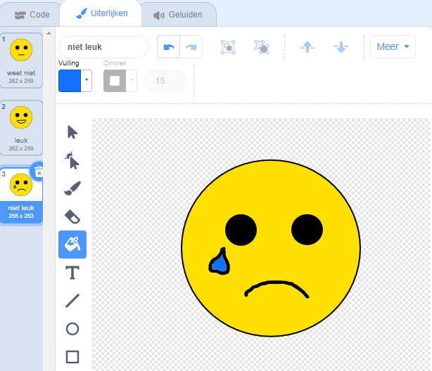

## Maak een emoji

<html>
  

    <iframe style="position: absolute; top: 0; left: 0; right: 0; width: 100%; height: 100%; border: none;" src="https://www.youtube.com/embed/RIz7WHhlBnQ?rel=0&cc_load_policy=1" allowfullscreen allow="accelerometer; autoplay; clipboard-write; encrypted-media; gyroscope; picture-in-picture; web-share"></iframe>
  

</html>

Nu jouw model onderscheid kan maken tussen positieve en negatieve opmerkingen, kun je het in een Scratch-programma gebruiken om een emoji-reactie weer te geven.

--- task ---

+ Klik op de link **<Terug naar project**.

+ Klik op **Maak**.

+ Klik op **Scratch 3**.

+ Klik op **Open in Scratch 3**.

--- /task ---

--- task ---

+ Verwijder de kat sprite. 

--- /task ---

--- task ---

+ Open het kies een sprite-menu en klik op het pictogram **Teken** om een nieuwe sprite te maken. 

--- /task ---

--- task ---

+ Teken een gezicht zonder mond. 

--- /task ---

--- task ---

+ Klik met de rechtermuisknop op het uiterlijk en klik op **dupliceren** om een kopie te maken. Herhaal dit nog een keer, zodat je **drie** exemplaren van het uiterlijk hebt.

--- /task ---

--- task ---

+ Om een uiterlijk een andere naam te geven, typ je een nieuwe naam in het witte vak. Noem de drie uiterlijken `weet niet`, `leuk` en `niet leuk`.

--- /task ---

--- task ---

+ Teken een mond op elk uiterlijk om elke emotie weer te geven.

--- /task ---

