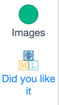
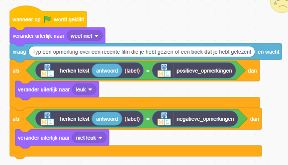

## Show a reaction

<html>
  

    <iframe style="position: absolute; top: 0; left: 0; right: 0; width: 100%; height: 100%; border: none;" src="https://www.youtube.com/embed/h6UBW0pWxmI?rel=0&cc_load_policy=1" allowfullscreen allow="accelerometer; autoplay; clipboard-write; encrypted-media; gyroscope; picture-in-picture; web-share"></iframe>
  

</html>

Machine Learning for Kids has added some special blocks to Scratch to allow you to use the model you just trained. Find them at the bottom of the blocks list.

--- task ---

+ Click on the **Code** tab.

--- /task ---

--- task ---

+ Add some code to ask the model to recognise whether the text is positive. If it is, the emoji will display the `like` face. 

--- /task ---

--- task ---

+ Click on the **green flag** to test your project. Typ een leuk bericht en druk op <kbd>Enter</kbd>. Het karakter moet glimlachen.

--- /task ---

Make sure that you test that this works **even for messages that you didn’t include in your training examples**.

--- task ---

+ Add some more code so that `if` the model recognises a negative comment, it displays the `dislike` costume.

--- collapse ---
---
title: Show me how
---

--- /collapse ---

--- /task ---

--- task ---

+ Klik opnieuw op de **groene vlag**. Typ een negatief bericht en druk op <kbd>Enter</kbd>. Het karakter moet er verdrietig uitzien.

--- /task ---

