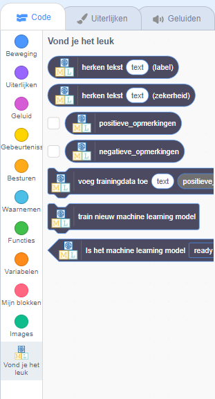
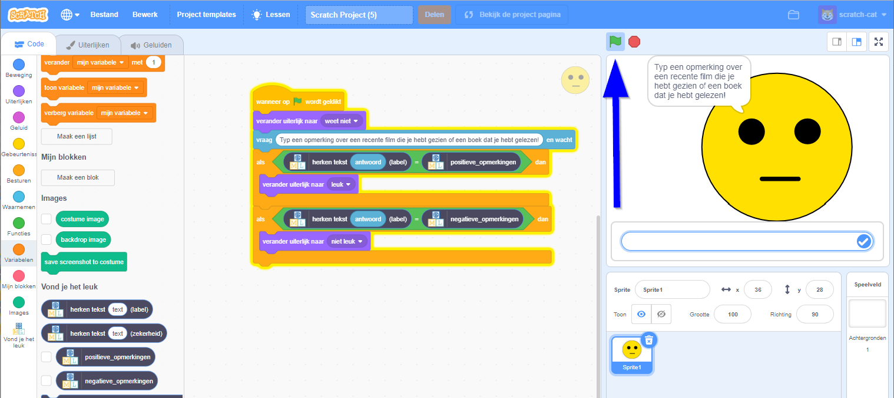
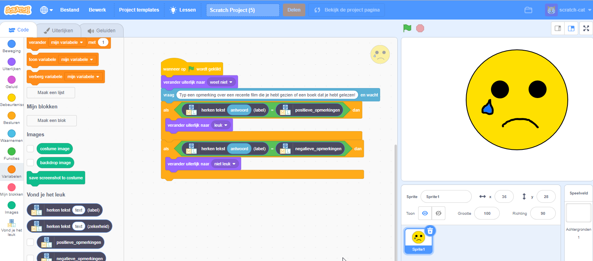

## Gebruik je machine learning-model in Scratch

Werk nu je Scratch-programma bij met je machine learning-model in plaats van een op regels gebaseerde aanpak.

\--- task \---
+ Klik op **< Terug naar project**.

+ Klik op **Maak**.

+ Klik op **Scratch 3**.

+ Klik op de knop **Open in Scratch 3** om de Scratch-editor te starten. Je zou de nieuwe blokken van je project onderaan de lijst moeten zien. 

+ Laad het Scratch-project dat je eerder hebt opgeslagen: klik op **Bestand**en vervolgens op **Uploaden van je computer** en selecteer vervolgens het Scratch-project dat je eerder hebt opgeslagen. \---/task\---

\--- task \---
+ Klik op het tabblad **Code** en werk vervolgens je Scratch-code bij om je machine learning-model te gebruiken **in plaats van** de regels die je eerder hebt toegevoegd. Het blok `herken tekst … (label)` is een nieuw blok dat door je project is toegevoegd. Als je tekst ingeeft, retourneert het ofwel `positieve opmerkingen` of `negatieve opmerkingen` op basis van de training die je aan de computer hebt gegeven. Je kunt dit gebruiken om het uiterlijk te kiezen om naar over te schakelen.  \--- /task \---

\--- task \---
+ Klik op de **groene vlag** om je project opnieuw te testen. 

+ Typ een leuk bericht en druk op <kbd>Enter</kbd>. Het karakter moet glimlachen. Klik opnieuw op de **groene vlag**. Typ een negatief bericht en druk op <kbd>Enter</kbd>. Het karakter moet er verdrietig uitzien. Zorg ervoor dat je test of dit werkt **zelfs voor berichten die je niet in je training hebt opgenomen.** 

+ Sla je project op: klik op **Bestand**en vervolgens op **Opslaan op je computer**. \---/task\---

Je hebt nu je Scratch-personage aangepast om machine learning te gebruiken in plaats van je eerdere, op regels gebaseerde aanpak. De computer trainen om berichten zelf te kunnen herkennen zou veel sneller moeten zijn dan proberen een lijst te maken van alle mogelijke berichten. Hoe meer voorbeelden je geeft, hoe beter het zou moeten zijn om berichten correct te herkennen.
