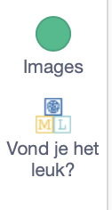
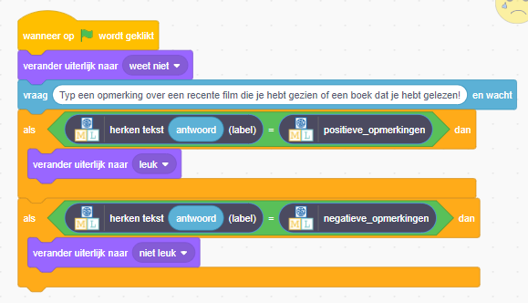
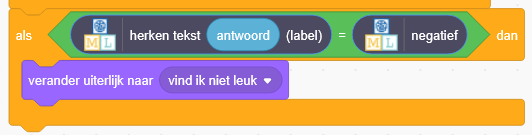

## Toon een reactie

<html>
  

    <iframe style="position: absolute; top: 0; left: 0; right: 0; width: 100%; height: 100%; border: none;" src="https://www.youtube.com/embed/h6UBW0pWxmI?rel=0&cc_load_policy=1" allowfullscreen allow="accelerometer; autoplay; clipboard-write; encrypted-media; gyroscope; picture-in-picture; web-share"></iframe>
  

</html>

Machine Learning for Kids heeft een paar speciale blokken aan Scratch toegevoegd om het model dat je net hebt getraind te kunnen gebruiken. Je vindt ze onderaan de lijst met blokken.

--- task ---

+ Klik op het **Code** tabblad.

--- /task ---

--- task ---

+ Voeg wat code toe om het model te vragen om te herkennen of de tekst positief is. Als dat zo is, zal de emoji het `vind ik leuk` gezicht weergeven. 

--- /task ---

--- task ---

+ Klik op de **groene vlag** om je project te testen. Typ een leuk bericht en druk op <kbd>Enter</kbd>. Het karakter moet glimlachen.

--- /task ---

Zorg ervoor dat je test of dit werkt **zelfs voor berichten die je niet in je training hebt opgenomen.**

--- task ---

+ Voeg nog wat code toe zodat `als` het model een negatieve opmerking herkent, het het `vind ik niet leuk` kostuum weergeeft.

--- collapse ---
---
title: Laat me zien hoe ik het moet doen
---

--- /collapse ---

--- /task ---

--- task ---

+ Klik opnieuw op de **groene vlag**. Typ een negatief bericht en druk op <kbd>Enter</kbd>. Het karakter moet er verdrietig uitzien.

--- /task ---

