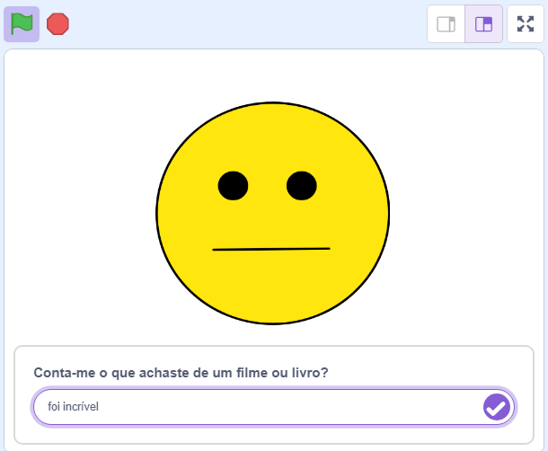

## O que vais fazer

Cria um personagem que reaja ao que tu digas sobre um filme ou livro, seja positivo ou negativo.

--- collapse ---

---
title: Onde estão armazenados os meus comentários?
---

- Este projeto usa uma tecnologia chamada "machine learning". Os sistemas de machine learning são treinados com uma grande quantidade de dados.
- Este projeto não exige que cries uma conta ou faças login. Para este projeto, os exemplos que usas para fazer o modelo são armazenados temporariamente no teu navegador (apenas na tua máquina).

--- /collapse ---

--- collapse ---
---
title: Não tens Youtube? Descarrega estes vídeos!
---

Podes [descarregar todos os vídeos para este projeto](https://rpf.io/p/en/did-you-like-it-go){:target="_blank"}.

--- /collapse ---

--- collapse ---
---
title: Licença
---

Este projeto possui dupla licença, sob uma [Licença Creative Commons Atribuição Não Comercial Partilha pela mesma Licença](http://creativecommons.org/licenses/by-nc-sa/4.0/){:target="_blank"} e uma [Licença Apache Versão 2.0](http://www.apache.org/licenses/LICENSE-2.0){:target="_blank"}.

Gostaríamos de agradecer ao Dale da machinelearningforkids.co.uk por todo o seu trabalho neste projeto.

--- /collapse ---

