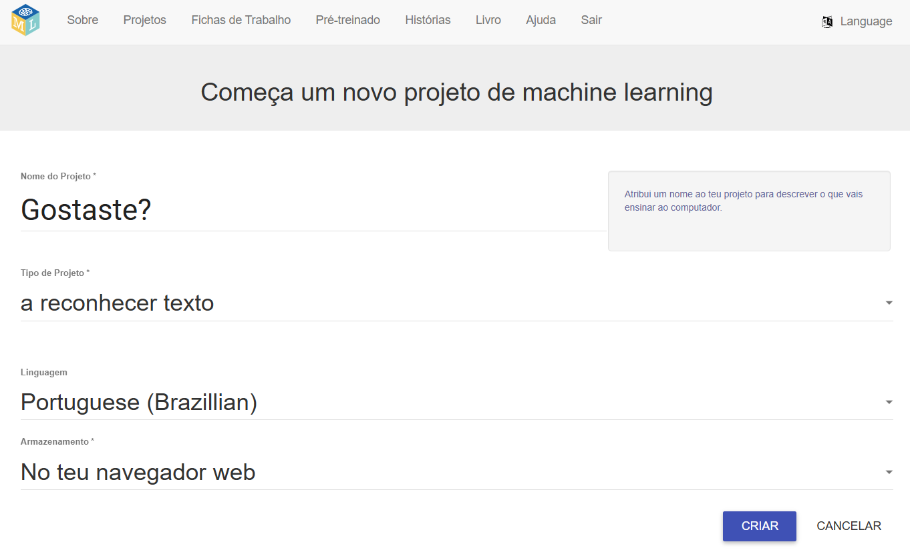
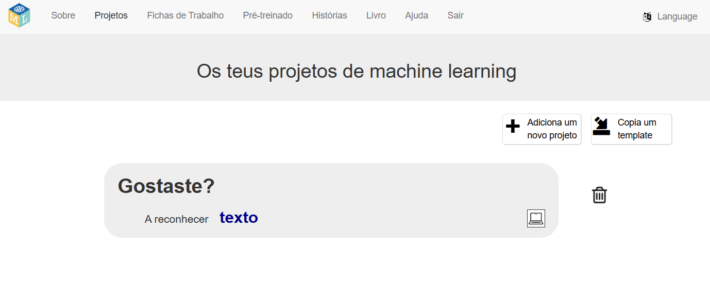
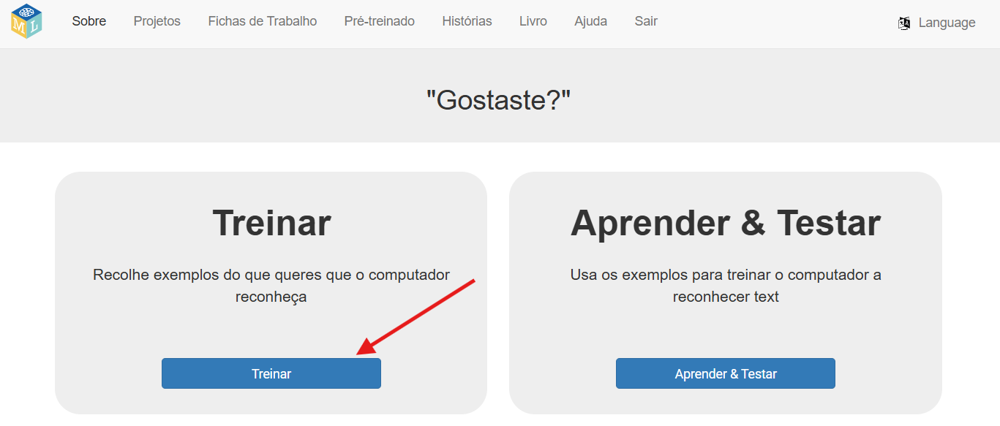

## Prepara o teu projeto

<html>
  

    <iframe style="position: absolute; top: 0; left: 0; right: 0; width: 100%; height: 100%; border: none;" src="https://www.youtube.com/embed/qD3ZlC_yzxA?rel=0&cc_load_policy=1" allowfullscreen allow="accelerometer; autoplay; clipboard-write; encrypted-media; gyroscope; picture-in-picture; web-share"></iframe>
  

</html>

--- task ---

+ Go to [machinelearningforkids.co.uk](https://machinelearningforkids.co.uk/){:target="_blank"} in a web browser.

+ Clica em **Começa agora**.

+ Clica em **Experimenta agora**.

--- /task ---

--- task ---

+ Clica em **Projetos** na parte superior do menu.

+ Clica no botão **+ Adicionar um novo projeto**.

+ Dá nome ao teu projeto `Gostaste?` e configura-o para aprender a reconhecer **texto**, e armazenar os dados **no teu navegador web**. E clica em **Criar**. 

+ You should now see 'Did you like it' in the projects list. Click on the project. 

--- /task ---

--- task ---

+ Clica no botão **Treinar**. 

--- /task ---

