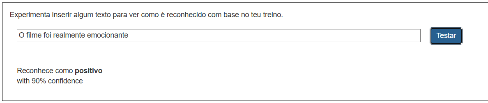

## Treina o modelo

<html>
  

    <iframe style="position: absolute; top: 0; left: 0; right: 0; width: 100%; height: 100%; border: none;" src="https://www.youtube.com/embed/y-Cf153mlwo?rel=0&cc_load_policy=1" allowfullscreen allow="accelerometer; autoplay; clipboard-write; encrypted-media; gyroscope; picture-in-picture; web-share"></iframe>
  

</html>

Reuniste os exemplos que precisas, e agora vais usar estes exemplos para treinar o teu modelo de machine learning.

--- task ---

+ Clica em **Voltar para o projeto** no canto superior esquerdo.

+ Clica em **Aprender & Testar**.

+ Clica no botão chamado **Treinar um novo modelo de Machine Learning**. Isto pode levar alguns minutos até terminar. 

--- /task ---

Assim que o treino acabar, podes testar o quão bem o teu modelo reconhece se o comentário é positivo ou negativo. Certifica-te que testas com exemplos que não utilizaste antes.

--- task ---

+ Digita algo simpático e pressiona <kbd>Enter</kbd>. Deve ser reconhecido como positivo.
+ Digita algo crítico e pressiona <kbd>Enter</kbd>. Deve ser reconhecido como negativo.

--- /task ---

Se não ficares satisfeito com o funcionamento do modelo a reconhecer comentários, volta à página **Treinar** e adiciona mais exemplos, depois treina o modelo outra vez.

