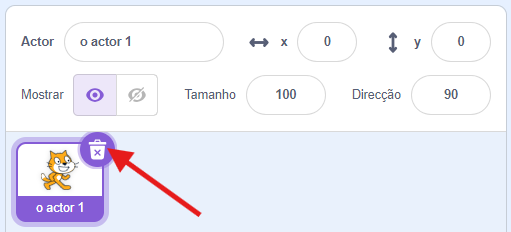
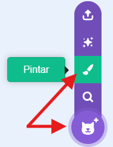
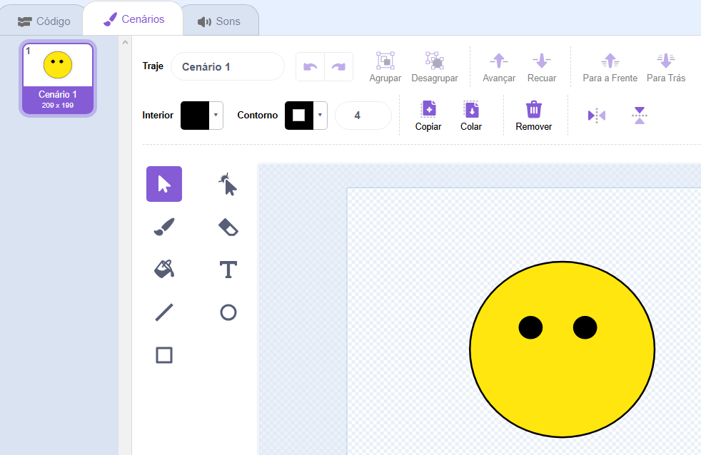
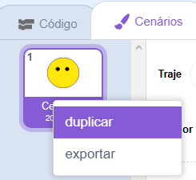
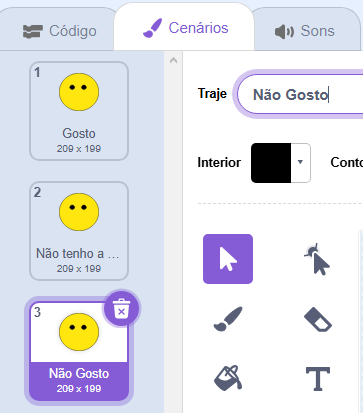
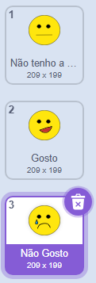

## Cria um emoji

<html>
  

    <iframe style="position: absolute; top: 0; left: 0; right: 0; width: 100%; height: 100%; border: none;" src="https://www.youtube.com/embed/RIz7WHhlBnQ?rel=0&cc_load_policy=1" allowfullscreen allow="accelerometer; autoplay; clipboard-write; encrypted-media; gyroscope; picture-in-picture; web-share"></iframe>
  

</html>

Agora que o teu modelo consegue distinguir entre comentários positivos e negativos, podes usá-lo num programa Scratch para exibir uma reação com emojis.

--- task ---

+ Clica no link **< Voltar para o projeto**.

+ Clica em **Criar**.

+ Clica no **Scratch 3**.

+ Clica em **Abre no Scratch 3**.

--- /task ---

--- task ---

+ Apaga o ator gato.

--- /task ---

--- task ---

+ Abre o novo menu de atores e clica no ícone **Pintar** para criar um novo ator. 

--- /task ---

--- task ---

+ Desenha um rosto sem boca. 

--- /task ---

--- task ---

+ Clica com o botão direito no traje e clica em **duplicar** para criar uma cópia. Repete mais uma vez, para ficares com **três** cópias do traje. 

--- /task ---

--- task ---

+ Para renomear o traje, digita um novo nome na caixa branca. Dá os nomes aos três trajes de `não tenho a certeza`, `gosto` e `não gosto`. 

--- /task ---

--- task ---

+ Desenha a boca em cada um dos trajes para representar cada emoção.

--- /task ---

