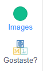
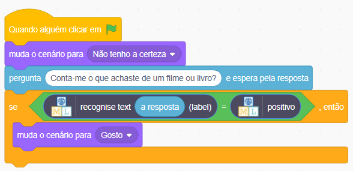
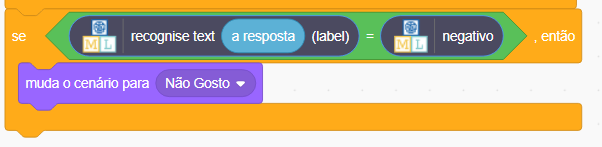

## Mostrar uma reação

<html>
  

    <iframe style="position: absolute; top: 0; left: 0; right: 0; width: 100%; height: 100%; border: none;" src="https://www.youtube.com/embed/h6UBW0pWxmI?rel=0&cc_load_policy=1" allowfullscreen allow="accelerometer; autoplay; clipboard-write; encrypted-media; gyroscope; picture-in-picture; web-share"></iframe>
  

</html>

Machine learning for Kids acrescentou alguns blocos especiais ao Scratch para permitir que utilizes o modelo que acabaste de treinar. Vais encontrar os blocos na última parte da lista.

--- task ---

+ Clica no separador **Código**.

--- /task ---

--- task ---

+ Adiciona algum código para pedir ao modelo que reconheça se o texto é positivo. Se for, o emoji vai exibir o rosto `gosto`. 

--- /task ---

--- task ---

+ Clica na **bandeira verde** para testar o teu projeto. Digita uma mensagem simpática e pressiona <kbd>Enter</kbd>. O personagem deve sorrir.

--- /task ---

Certifica-te que testas se está a funcionar **até para mensagens que não incluíste nos teus exemplos de treino**.

--- task ---

+ Adiciona mais algum código para que `se` o modelo reconhecer um comentário negativo, exiba o traje de `não gosto`.

--- collapse ---
---
title: Mostra-me como
---

--- /collapse ---

--- /task ---

--- task ---

+ Clica na **bandeira verde** de novo. Digita uma mensagem negativa e pressiona <kbd>Enter</kbd>. O personagem deve parecer triste.

--- /task ---

